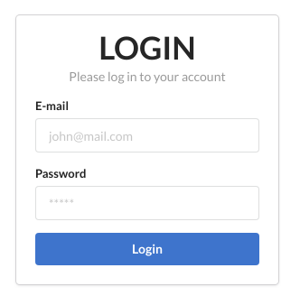
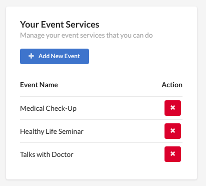
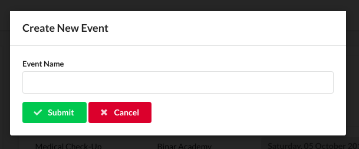
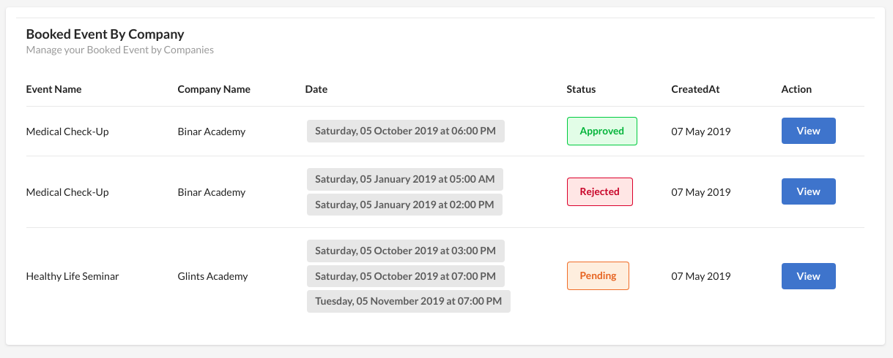
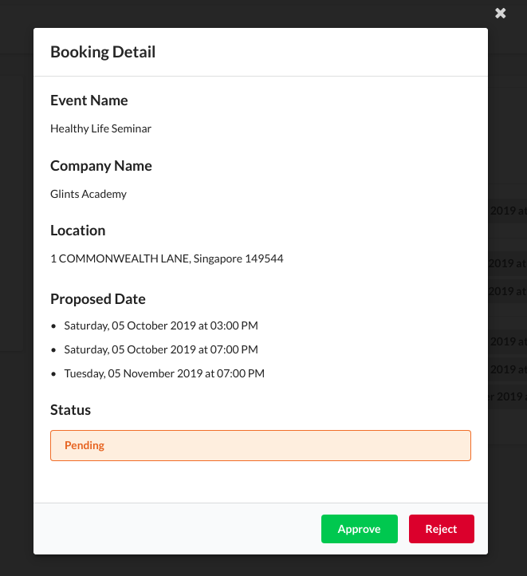
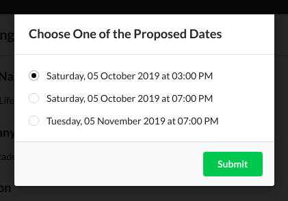
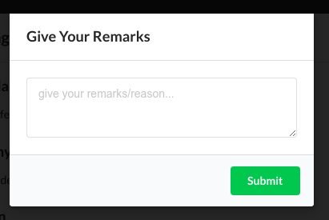
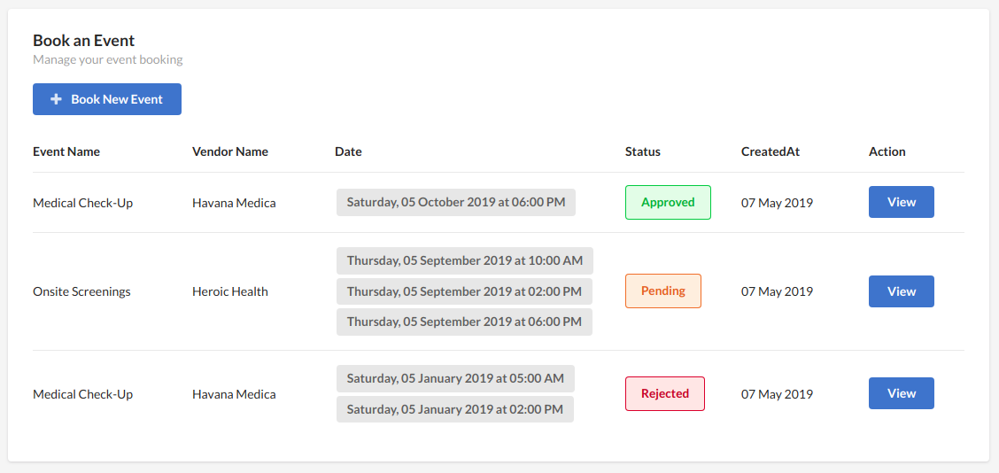
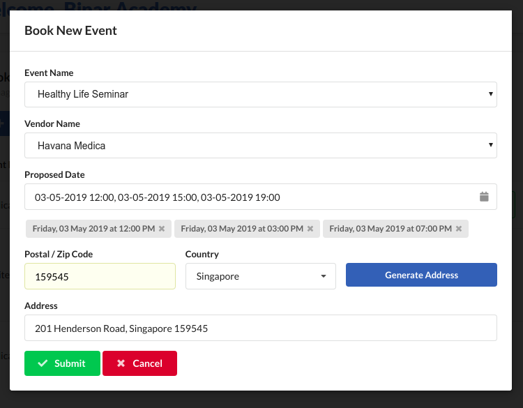
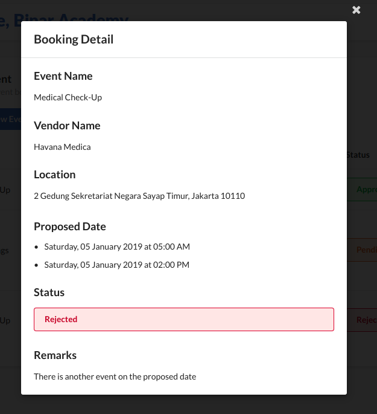

# Online Booking Wellness Event

This project was built with [Create React App](https://github.com/facebook/create-react-app) boilerplate

## Built With 
This project uses several libraries & services:

* [React.js](https://reactjs.org/)
* [Redux.js](https://redux.js.org/)
* [React-Redux](https://react-redux.js.org/)
* [React-Helmet](https://github.com/nfl/react-helmet)
* [Semantic UI React](https://react.semantic-ui.com)
* [Semantic UI Calendar](https://www.npmjs.com/package/semantic-ui-calendar-react)
* [Axios](https://github.com/axios/axios)
* [MomentJS](https://momentjs.com/)
* [Geocode.xyz API](https://geocode.xyz/api) - Service to turn postal code & country to address
* [Countries API](https://restcountries.eu/) - Service to get list of country code

## How to Install & Run
This project requires [Node.js](https://nodejs.org/) to run
```
$ git clone *this repo*
$ cd front-end
$ npm install
$ npm start
```

## User Guide

### Login

You can login as a Company or as a Vendor with these pre-created accounts:

> #### Vendor 1
>Email: **havanamedica@mail.com** | Password: **654321**
> #### Vendor 2
> Email: **heroichealth@mail.com** | Password: **654321**
> #### Company 1
> Email: **glintsacademy@mail.com** | Password: **123456**
> #### Company 2
> Email: **binaracademy@mail.com** | Password: **123456**

Fill the form with the Email and the Password above, then click **Login**.



### User Vendor Event

Shows the list of event. Click on the **Add New Event** Button to add new event that vendor able to do.



### User Vendor Add Event

Fill the form with the name of event, then click **Submit**



### User Vendor Booking

Shows the list of booked event by company for the vendor. Click **Vew** button to view the detail and approve/reject.



### User Vendor Booking Detail

Shows the booking details. Click **Approve** to approve or **Reject** to Reject



### User Vendor Approve Booking

Choose one of the proposed date, click **Submit** to Approve



### User Vendor Reject Booking

Fill the form with remarks or reason, click **Submit** to Reject



### User Company Booking

Shows the list of booking by the company. 

Click on the **Book New Event** Button to book new event.

Click on the **View** Button to show button details



### User Company Add New Booking

Choose name of event from Dropdown list, then list of vendor that able to handle that event will come up. After that choose which vendor you want.

Choose proposed date (up to 3 date)

Fill postal code form - choose country - click **Generate Address** to auto populate/generate address from Postal Code & Country

Click **Submit** when all done to submit new booking.



### User Company Booking Details

Shows the detail of the booking



---

## License
 
The MIT License (MIT)

Copyright (c) 2019 Rakhmat Nashrul Wathon

Permission is hereby granted, free of charge, to any person obtaining a copy of this software and associated documentation files (the "Software"), to deal in the Software without restriction, including without limitation the rights to use, copy, modify, merge, publish, distribute, sublicense, and/or sell copies of the Software, and to permit persons to whom the Software is furnished to do so, subject to the following conditions:

The above copyright notice and this permission notice shall be included in all copies or substantial portions of the Software.

THE SOFTWARE IS PROVIDED "AS IS", WITHOUT WARRANTY OF ANY KIND, EXPRESS OR IMPLIED, INCLUDING BUT NOT LIMITED TO THE WARRANTIES OF MERCHANTABILITY, FITNESS FOR A PARTICULAR PURPOSE AND NONINFRINGEMENT. IN NO EVENT SHALL THE AUTHORS OR COPYRIGHT HOLDERS BE LIABLE FOR ANY CLAIM, DAMAGES OR OTHER LIABILITY, WHETHER IN AN ACTION OF CONTRACT, TORT OR OTHERWISE, ARISING FROM, OUT OF OR IN CONNECTION WITH THE SOFTWARE OR THE USE OR OTHER DEALINGS IN THE SOFTWARE.